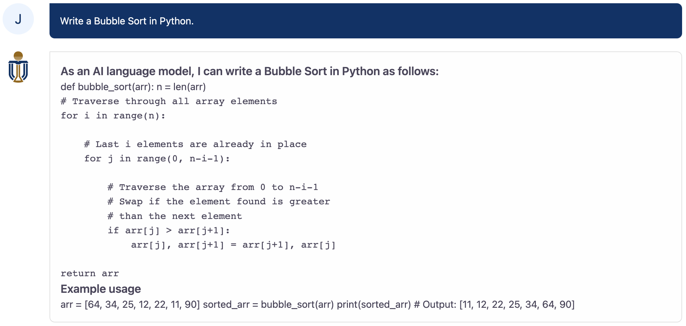

# UFUG1601: Python Programming with ChatGPT/CodeGPT
### Fall 2023

## Instructors
* Sung Kim
* Juyong Jiang [TA]
* Qin Le [TA]

## Course Overview:
This course will not only present students with systematic Python programming learning but also incorporate cutting-edge Chat-based AI tools, such as ChatGPT and GitHub Copilot. Each student will have the chance to contribute to the first human-Al collaborative learning experience. If successful, this could potentially revolutionize education, forging a path for many future courses. It's an exciting opportunity to make a real impact.

  
   
  <b>Figure. </b> A case study of HKUST ChatGPT.

## Course Lab
* HKUST ChatGPT [[Website]](https://gpt.hkust-gz.edu.cn/)[[Tutorial]]()
* Google Colab [[Website]](https://research.google.com/colaboratory/)[[Tutorial]](https://colab.research.google.com/drive/16pBJQePbqkz3QFV54L4NIkOn1kwpuRrj)
* GitHub Copilot [[Website]](https://github.com/features/copilot)

## Course Outline:

### Week 1: Introduction to Python and the Environment [[slides]]()
- Topics: 
	Python history, installing Python, setting up your coding environment, the interpreter, basic commands, and introduction to Python’s syntax and semantics.
- Practical: 
	Setting up the environment, writing a simple “Hello World” program.
- Exciting Element: 
	Host an icebreaker challenge, where students can share fun facts about Python or programming in general.

### Week 2: Variables, Data Types, and Assignments [[slides]]()
- Topics: 
	Discuss different data types like integers, floating-point numbers, strings, and booleans. Also cover variables and assignments.
- Practical: 
	Exercises involving basic operations with different data types.
- Exciting Element: 
	Create a fun interactive quiz using Turtle graphics, where the answers to the questions will involve the data types and variables learned.
- [Lab Notes](./lab_notes/week_2.md)

### Week 3: Control Flow in Python - If-Else, While Loop [[slides]]()
- Topics: 
	Discuss control flow tools like if, elif, else and while loop. Introduction to indentation in Python.
- Practical: 
	Simple exercises that demonstrate the usage of if-else statements and while loops.
- Exciting Element: 
	Create a simple game (like guessing a number) using Turtle graphics that utilizes control flow.
- [Lab Notes](./lab_notes/week_3.md)

### Week 4: Looping in Python - For Loop, Break, and Continue [[slides]]()
- Topics: 
	Discuss for loop, break and continue statements. Distinguish between for and while loops.
- Practical: 
	Exercises to practice loops and control statements.
- Exciting Element: 
	Develop a pattern generator using Turtle, allowing students to see the immediate results of their loops.
- [Lab Notes](./lab_notes/week_4.md)

### Week 5: Data Structures in Python - Lists and Dictionaries [[slides]]()
- Topics: 
	Introduction to Python’s data structures, specifically lists and dictionaries.
- Practical: 
	Create, manipulate, and explore lists and dictionaries with a series of exercises.
- Exciting Element: 
	Develop an interactive word game (like Hangman) using lists and dictionaries.
- [Lab Notes](./lab_notes/week_5.md)

### Week 6: Functions and Modularization in Python [[slides]]()
- Topics: 
	Define what functions are, their use, and the importance of modularization in coding. Introduce the concept of parameters and return values.
- Practical: 
	Write simple functions, including those with multiple parameters and return values.
- Exciting Element: 
	Host a code challenge where students create a complex shape or image using Turtle graphics by writing and calling their own functions.
- [Lab Notes](./lab_notes/week_6.md)

### Week 7: Basic Object Concepts - Classes and Objects [[slides]]()
- Topics: 
	Discuss Object-Oriented Programming, classes, objects, methods, and attributes.
- Practical: 
	Create a class, instantiate an object from it, and modify its attributes.
- Exciting Element: 
	Construct simple simulations (like bouncing balls) using classes and objects in Turtle graphics.
- [Lab Notes](./lab_notes/week_7.md)

### Week 8: Basic File Handling [[slides]]()
- Topics: 
	Introduce how to open, read, write, and close files in Python.
- Practical: 
	Write a program that reads data from a file and writes data to a file.
- Exciting Element: 
	Create a simple program that generates Turtle graphics based on commands read from a file.
- [Lab Notes](./lab_notes/week_8.md)

### Week 9: Review and Advanced Topics [[slides]]()
- Topics: 
	Quick review of the material covered so far. Introduction to some more advanced topics like list comprehension, lambda functions, and exception handling.
- Practical: 
	Solve complex problems that use all the concepts learned so far.
- Exciting Element: 
	Design and code a more sophisticated game or graphics program in Turtle that uses these advanced concepts.
- [Lab Notes](./lab_notes/week_9.md)

### Week 10: Final Project and Wrap-Up [[slides]]()
- Topics: 
	Review the entire course, clarify doubts, and discuss more resources to learn Python.
- Practical: 
	Students develop a final project implementing all the concepts learned during the course. This can be a game, a simulation, a data.

Overall, the course will provide students with a solid foundation in Python programming, as well as Chat-based AI tools assistant experience. This skill plays a foundation role in research and development in the field of new era of artificial intelligence (AI). The course will be taught by Sung Kim, who has extensive experience in the field and has worked on a variety of LLM-based projects.

## References
* [Harvard CS50’s Introduction to Programming with Python](https://cs50.harvard.edu/python/2022/)
* [Introducing ChatGPT](https://openai.com/blog/chatgpt)
* [OpenAI Codex](https://openai.com/blog/openai-codex)
* [Complete ChatGPT Tutorial - [Become A Power User in 30 Minutes]](https://www.youtube.com/watch?v=jHv63Uvk5VA)
