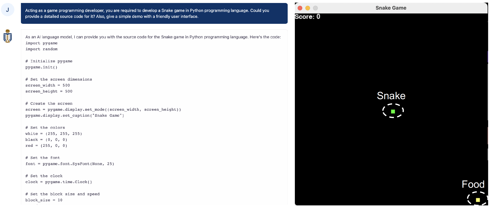

# Install & Use Anaconda on Windows, Mac, and Linux: A Comprehensive Guide
## Table of Contents
- [Overview](#overview)
- [What is the Anaconda Distribution?](#what-is-the-anaconda-distribution)
- [Why Anaconda?](#why-anaconda)
- [Step-by-Step Installation Guide](#step-by-step-installation-guide)
  - [Installing on Windows](#installing-on-windows-link)
  - [Installing on macOS](#installing-on-macos-link)
  - [Installing on Linux](#installing-on-linux-link)
  - [Verifying your installation](#verifying-your-installation-link)
  - [Uninstalling Anaconda Distribution](#uninstalling-anaconda-distribution-link)
- [How to Use Conda](#how-to-use-conda)
  - [1. Conda Environment Management](#1-conda-environment-management)
  - [2. Conda Packages Management](#2-conda-packages-management)
  - [3. Reproducing a Conda Environment](#3-reproducing-a-conda-environment)
  - [4. Managing Conda Channels](#4-managing-conda-channels)
  - [5. Execute Python Script](#5-execute-python-script)
- [Snake Game Demo](#snake-game-demo)
- [Jupyter Notebook & Google Colab & VSCode](#jupyter-notebook--google-colab--vscode)
- [Reference](#reference)

## Overview
Python is a versatile language that has found its way into various fields, from web development to data science. However, managing Python environments can be a bit tricky, especially when you have multiple projects with different dependencies. This is where Anaconda comes in. Anaconda is a free and open-source distribution of Python and R for scientific computing. It simplifies package management and deployment, making it easier to manage your Python environments. In this guide, we’ll walk you through the process of installing Anaconda over an existing Python system.

## What is the Anaconda Distribution?
Anaconda is a trusted suite that bundles Python and R distributions. Anaconda is a package manager and virtual environment manager, and it includes a set of pre-installed software packages. The Anaconda open-source ecosystem is mainly used for data science, machine learning, and large-scale data analysis. Anaconda is popular because it's simple to install, and it provides access to almost all the tools and packages that data professionals require, including the following:

* the Python interpreter
* an extensive collection of packages
* Conda, a package and virtual environment management system
* Jupyter Notebook, a web-based interactive integrated development environment (IDE) that combines code, text, and visualizations in the same document
* Anaconda Navigator, a desktop application that makes it easy to launch software packages that come with Anaconda distribution and manages packages and virtual environments without using command-line commands

## Why Anaconda?

Anaconda is a popular choice among data scientists for several reasons:

* Simplified Package Management: Anaconda comes with Conda, a powerful package manager that makes it easy to install, run, and update complex data science libraries.
* Environment Management: With Anaconda, you can create isolated environments for your projects, ensuring that dependencies for each project are managed separately.
* Pre-packaged Libraries: Anaconda comes with over 1,500 pre-packaged libraries, saving you the hassle of manual installation.
* Cross-platform: Whether you’re using Windows, macOS, or Linux, Anaconda has got you covered.

## Step-by-Step Installation Guide
Anaconda is a cross-platform Python distribution that you can install on Windows, macOS, or different distributions of Linux.
**Note that** if you already have Python installed, you don’t need to uninstall it. You can still go ahead and install Anaconda and use the Python version that comes along with Anaconda distribution.

#### Installing on Windows [[Link]](https://docs.anaconda.com/free/anaconda/install/windows/)

#### Installing on macOS [[Link]](https://docs.anaconda.com/free/anaconda/install/mac-os/)

#### Installing on Linux [[Link]](https://docs.anaconda.com/free/anaconda/install/linux/)

#### Verifying your installation [[Link]](https://docs.anaconda.com/free/anaconda/install/verify-install/)

#### Uninstalling Anaconda Distribution [[Link]](https://docs.anaconda.com/free/anaconda/install/uninstall/)

## How to Use Conda
In this section, we will learn how to use Conda to `create`, `activate`, and `deactivate` **virtual environments**. In addition, we will discuss `installing/uninstalling packages` in an environment and `managing channels`.

If you want to learn more about Python virtual environments, you can read [A Complete Guide to Python Virtual Environments](https://www.dataquest.io/blog/a-complete-guide-to-python-virtual-environments/) on the Dataquest blog.

First, let’s check the `conda` version installed on our computers. To do so, open a terminal window on macOS/Linux or an Anaconda Prompt on Windows, then run the following command:

```bash
(base) ~ % conda --version or --v
conda 4.12.0
```

The default environment in Anaconda is the base environment that is created when you install Anaconda. So, every time you open a terminal window, the environment’s name appears in parentheses at the start of the terminal prompt. The base environment contains `conda` as well as more than 400 pre-installed packages. Now, let’s discuss how we can manage environments with conda commands.

#### 1. Conda Environment Management

```bash
# create a conda environment with the name of `env_name`
conda create --name[--n] env_name 
conda create --name[--n] env_name python # with the latest version of Python
conda create --name[--n] env_name python=3.8 # with a specific Python version, e.g., 3.8

# activate a conda environment
activate env_name # for Windows
conda activate env_name # for Linux & Mac

# display the active environment details
python [--version][--v] # Windows
which python # Linux & Mac
conda info 
# list all virtual environments of anaconda
conda info --envs or --env or -e
conda env list

# deactivate a conda environment
deactivate  # Windows
conda deactivate [env_name] # Linux & Mac

# delete a conda environment
conda remove --name env_name --all
# rename a conda environment
conda create -n env_name_new --clone env_name_old 
conda remove -n env_name_old --all 
```

#### 2. Conda Packages Management

```bash
# install package in current active environment or [in specific environment `env_name`]
conda install [-n env_name] package-name
conda install [-n env_name] package-name=1.2.x # specify version number
pip install package-name==1.2.x # if you use pip install, use `==` instead of `=`
conda install [-n env_name] package-name_1 package-name_2 package-name_3 # install a set of packages 1, 2, 3

# conda (pip) install from configuration file `requirements.txt`
pip install -r requirements.txt

# install package in a specific channel
conda install --channel[-c] https://conda.anaconda.org/anaconda package-name
# pip install package locally
pip install ～/Downloads/package-name.whl
# install package locally
conda install --use-local  ~/Downloads/package-name.tar.bz2

# uninstall package
conda uninstall package-name
# delete package in current active environment or [in a specific conda environment `env_name`]
conda remove [-n env_name] package-name

# list installed packages in current active environment or [in specific environment `env_name`]
conda list [-n env_name]
# search package information from conda channels
conda search package-name

# update package in current active environment or [in a specific conda environment `env_name`]
conda update [-n env_name] package-name
# /***conda treats conda, anaconda, and python as package***/
# update conda
conda update conda
# update anaconda
conda update anaconda
# update python as the latest version of 3.8.x series.
conda update python
# update anaconda-navigator
conda update anaconda-navigator   
```

#### 3. Reproducing a Conda Environment

It’s a common task to reproduce an environment on your computer or other computers. Conda (pip) allows us to make a YAML (TXT) file that contains all the installed packages in an environment along with the versions. 

```bash
# export current active environment to a YAML file that contains all the installed packages along with the versions 
# use the --from history option to ensure your environment file works on various platforms
conda env export [--from history] > environment.yml 
# use the environment file to reproduce the Anaconda environment on any machine with the default name in the file or [set a new env name]   
conda env create [-n env_name_new] -f environment.yml 

# use the pip to output the packages and their versions installed in the current environment as a configuration file
pip freeze > requirements.txt
# copy or move this requirements.txt to the other environment and use it to install the packages
pip install -r requirements.txt
```

#### 4. Managing Conda Channels

`Channels` are Conda’s package repositories hosted on remote servers. Conda searches these repositories containing Conda packages whenever you want to install a package. Then the package will automatically be downloaded and installed from the channels. 

```bash
# show the name of current Conda channels
conda config --show channels
conda config --get channels
# reveal the URLs to the default channel’s folders
conda config --show default_channels
# add new channels
conda config --add channels channels_urls/channels_name  
# e.g., add the channels mirrors of Tsinghua university as follows:
# conda config --add channels https://mirrors.tuna.tsinghua.edu.cn/anaconda/pkgs/free/
# conda config --add channels https://mirrors.tuna.tsinghua.edu.cn/anaconda/pkgs/main/
# conda config --add channels https://mirrors.tuna.tsinghua.edu.cn/anaconda/cloud/conda-forge/
# conda config --add channels https://mirrors.tuna.tsinghua.edu.cn/anaconda/cloud/bioconda/
# set to show channel URLs
conda config --set show_channel_urls yes
```

Sometimes, when we want to install a package, Conda issues the `PackagesNotFoundError` message, which means the package is unavailable from current channels. 
There are three ways to solve the issue:
* check the name of package-name that you want to install one more time
* specify a channel (e.g., conda-forge) that the package exists in its repositories
```bash
conda install -c conda-forge package-name
```
* add a new channel that contains the package to the top of the channel list, then installing the package
```bash
conda config --add channels channels_urls
conda install package-name
```

#### 5. Execute Python Script

After you create a conda virtual environment along with required packages, you can run python script in your terminal. 
```bash
conda activate env_name
python script_name.py # e.g., snake.py
```

#### 6. Conda Use Example

```bash
(base) john@MacBook-Pro UFUG1601 % conda create --name ufug1601 python=3.8
(base) john@MacBook-Pro UFUG1601 % conda activate ufug1601
(ufug1601) john@MacBook-Pro UFUG1601 % conda --version
(ufug1601) john@MacBook-Pro UFUG1601 % conda info
(ufug1601) john@MacBook-Pro UFUG1601 % conda env list
(ufug1601) john@MacBook-Pro UFUG1601 % conda list
(ufug1601) john@MacBook-Pro UFUG1601 % conda install pandas
(ufug1601) john@MacBook-Pro UFUG1601 % conda config --show channels
(ufug1601) john@MacBook-Pro UFUG1601 % conda config --add channels conda-forge
# run snake.py script
(ufug1601) john@MacBook-Pro UFUG1601 % python snake.py
```

**Note that** 
If you don’t like managing environments and packages by typing Conda commands in a command-line shell, you can use Anaconda Navigator. Navigator provides a graphical user interface (GUI) to manage environments and packages without using Conda commands. Nevertheless, Conda commands are recommended. 

## Snake Game Demo

**Step 1:** 
Prompting HKUST ChatGPT as follows:

```bash
Acting as a game programming developer, you are required to develop a Snake game in Python programming language. 
Could you provide a detailed source code for it? Also, give a simple demo with a friendly user interface. 
```

Note that if you don't obtain a good source code of snake game from HKUST ChatGPT, you can directly use [this script](./snake.py).

**Step 2:**
Copying and paste the response of HKUST ChatGPT into a file with `.py` file extension and `snake` file name. 

**Step 3:**
Installing Python dependencies (packages) and then run the script as follows: 
```bash
conda install pygame
python snake.py
```

<p align="center">
  
  <br>
  <b>Figure 1.</b> A snake demo of HKUST ChatGPT.
</p>

## Jupyter Notebook & Google Colab & VSCode
The heart of the Anaconda distribution is the [`Jupyter Notebook`](https://jupyter.org/); data scientists love Jupyter Notebook because it simplifies developing and presenting their projects `interactively`. If you're interested in learning more about Jupyter Notebook, there is an excellent tutorial on the Dataquest blog at [How to Use Jupyter Notebook in 2020: A Beginner’s Tutorial](https://www.dataquest.io/blog/jupyter-notebook-tutorial/).

[`Google Colab`](https://colab.research.google.com/) is a hosted Jupyter Notebook service that requires no setup to use and provides free access to computing resources, including GPUs and TPUs. Colab is especially well suited to machine learning, data science, and education. There is a Google Colab tutorial at [Google Colab Tutorial for Data Scientists](https://www.datacamp.com/tutorial/tutorial-google-colab-for-data-scientists).

[`Visual Studio Code`](https://visualstudio.microsoft.com/), also commonly referred to as **VS Code**, is a `lightweight but powerful` source code editor which runs on your desktop and is available for Windows, macOS and Linux. It comes with built-in support for JavaScript, TypeScript and Node.js and has a rich ecosystem of extensions for other languages and runtimes (such as C++, C#, Java, Python, PHP, Go, .NET). If you want to set up VSCode for Python, please reviewing this tutorial at [Setting Up VSCode For Python: A Complete Guide](https://www.datacamp.com/tutorial/setting-up-vscode-python). 

## Reference
* [https://docs.anaconda.com/free/anaconda/install/](https://docs.anaconda.com/free/anaconda/install/)
* [Install Python on Windows, Mac, and Linux](https://www.tutorialsteacher.com/python/install-python)
* [How to Install the Anaconda Distribution on Your Computer](https://www.dataquest.io/blog/how-to-install-the-anaconda-distribution-on-your-computer/)
* [Installing Anaconda Over Existing Python System: A Guide](https://saturncloud.io/blog/installing-anaconda-over-existing-python-system-a-guide/)
* [How to install Python packages with pip and requirements.txt](https://note.nkmk.me/en/python-pip-install-requirements/#:~:text=Install%20packages%20with%20pip%20%3A%20%2Dr%20requirements.txt,-Use%20the%20command&text=You%20can%20name%20the%20configuration,%2Fto%2Frequirements.txt%20.)
* [How to Use Jupyter Notebook: A Beginner’s Tutorial](https://www.dataquest.io/blog/jupyter-notebook-tutorial/)
* [Google Colab Tutorial for Data Scientists](https://www.datacamp.com/tutorial/tutorial-google-colab-for-data-scientists)
